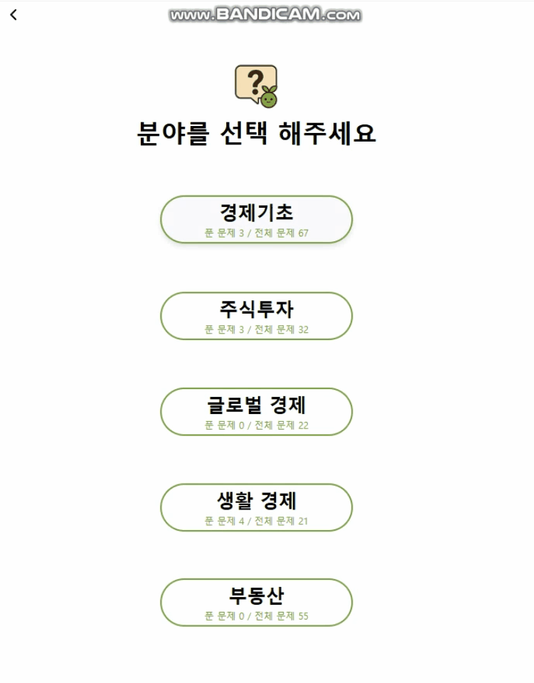
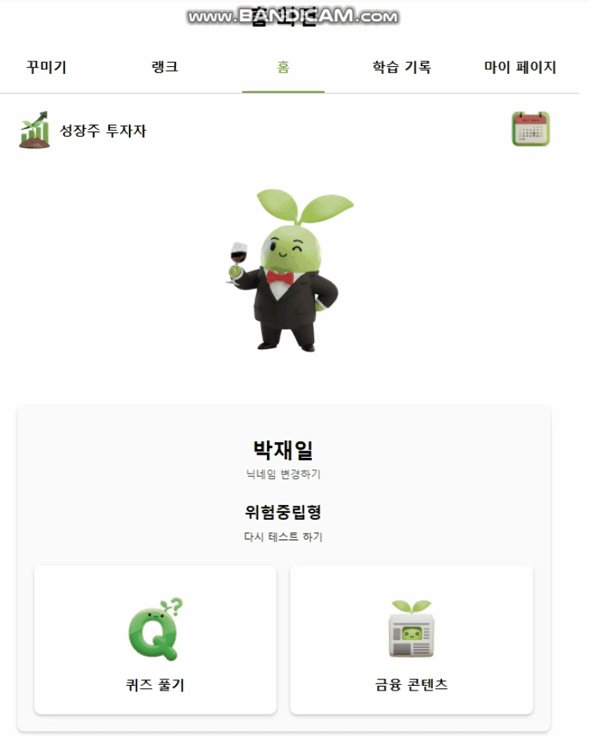
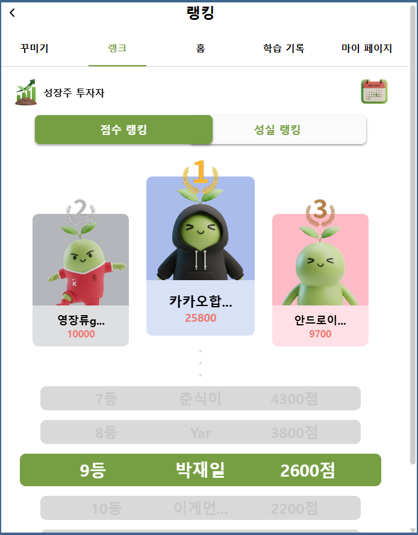
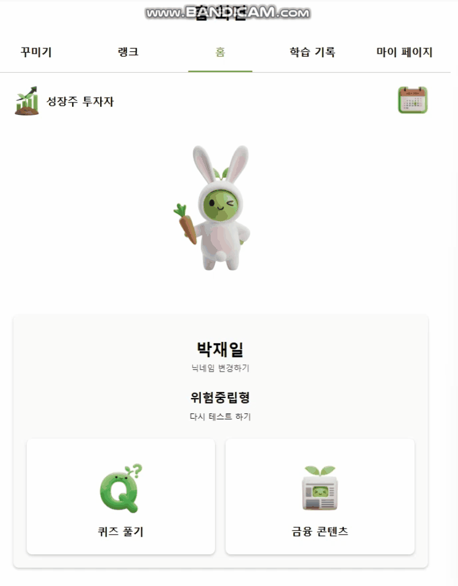
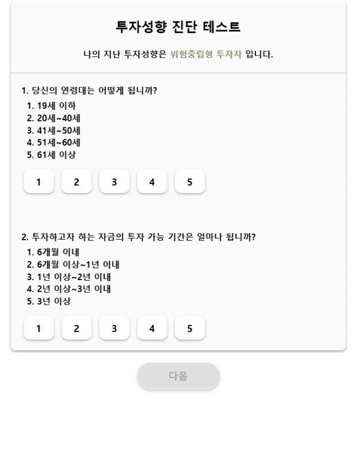
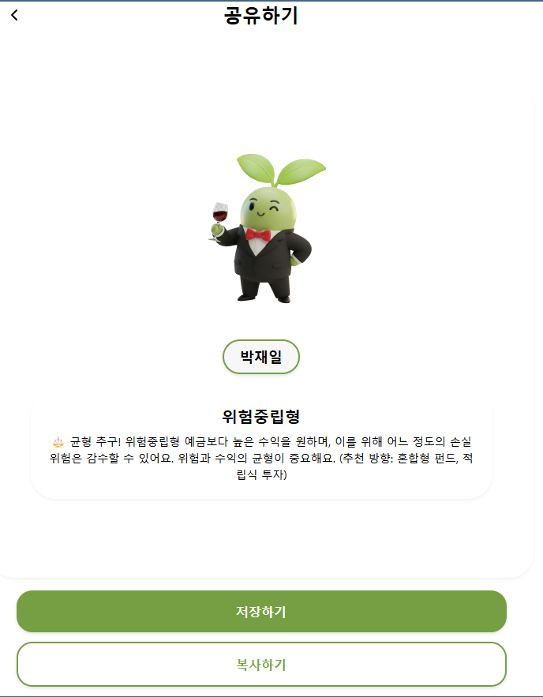

# 이게머니 – 쉽고 정확하게, 나만의 경제 교과서

<p align="center">
  
</p>

## 서비스 배경

- 최근 사회 초년생과 청년층 사이에서 금융 문맹(금융지식 부족) 문제가 심화되고 있습니다.
- 금융 지식이 부족한 상태에서 대출, 투자, 소비를 시작하면서 실제로 피해를 입는 사례가 점점 늘어나고 있습니다.
- 잘못된 금융 판단은 과소비, 부채 누적, 금융사기 피해 등으로 이어질 수 있습니다.
- 하지만 정규 교육과정에서는 실질적인 금융 교육의 기회가 여전히 부족하며, 제공되는 일부 프로그램도 이론 위주라 흥미와 접근성이 낮은 한계가 존재합니다.

## 소개

금융 교육을 위한 게이미피케이션 웹 애플리케이션입니다. 사용자는 퀴즈 풀기, 투자 성향 테스트, 금융 콘텐츠 탐색, 랭킹 시스템, 출석 체크 등을 통해 금융 지식을 습득할 수 있습니다.

- 퀴즈를 풀며 캐릭터 '콩식이'를 성장시키고 꾸미는 과정에서 느끼는 학습의 재미와 성취감 제공
- 에빙하우스 망각 곡선 기반 오답 문제 복습 시스템, 북마크, 오답 노트 등의 기능을 통한 체계적이고 효율적인 학습
- 초보자도 입문하기 쉬운 '경제 기초'와, 주식 시장, 글로벌 경제, 생활 경제, 부동산 등 실생활에 도움이 되는 유용한 개념을 다루는 문항들로 퀴즈 구성
- 자투리 시간에도 부담 없이 학습이 가능하도록 간단한 구조로 설계
- 중·고등학생은 등·하교 시간 등 일상 속에서 금융 기초를 쉽게!
- 사회 초년생과 직장인도 출퇴근 시간 등 짧은 틈을 활용해 실질적인 금융 지식을 쉽게!
- 금융 콘텐츠 탭을 통해 사용자에게 도움이 될 금융 관련 정보, 정책, 상품 등을 쉽게 찾아볼 수 있도록 설계
- 이를 통해 금융 교육의 접근성을 높이고, 재미있는 학습 경험을 제공합니다

## 주요 기능

<table>
  <tr>
    <td align="center" width="50%">
      <b>퀴즈 풀이 및 해설</b><br/>
      - 4개 카테고리 별 퀴즈 제공<br/>
      - 4지선다, O/X, 주관식 유형 제공<br/><br/>
      
    </td>
    <td align="center" width="50%">
      <b>오답 날짜 기반 자동 복습</b><br/>
      - 오답 문제 자동 복습 시스템<br/>
      - 학습 전 1일/4일 전 틀린 문제 제공<br/><br/>
      
    </td>
  </tr>

  <tr>
    <td align="center" width="50%">
      <b>출석 기능</b><br/>
      - 5문제 풀이 시 일일 출석 기록<br/>
      - 연속 출석 랭킹으로 꾸준한 학습 동기 고취<br/><br/>
      
    </td>
    <td align="center" width="50%">
      <b>랭킹 및 티어 시스템</b><br/>
      - 레이팅 기반 티어 제공<br/>
      - 누적 퀴즈 풀이, 연속 출석일별 랭킹 순위 제공<br/><br/>
      
    </td>
  </tr>

  <tr>
    <td align="center" width="50%">
      <b>코스튬 기능</b><br/>
      - 나만의 메인 캐릭터 '콩식이' 꾸미기<br/>
      - 추후 퀴즈 풀이로 얻는 코인 도입해 기능 강화 예정<br/><br/>
      
    </td>
    <td align="center" width="50%">
      <b>금융 컨텐츠</b><br/>
      - 다양한 금융 상품 소개<br/>
      - 사람들이 놓칠 수 있는 실생활 금융 정보 제공<br/><br/>
      
    </td>
  </tr>

  <tr>
    <td align="center" width="50%">
      <b>투자 성향 진단 기능</b><br/>
      - 자가 체크리스트를 통한 내 투자 성향 진단<br/>
      - 5가지 투자 성향 제공<br/><br/>
      
    </td>
    <td align="center" width="50%">
      <b>성향 및 티어 공유 기능</b><br/>
      - 나의 투자 성향 테스트 결과 및 내 티어 이미지 공유 기능<br/><br/>
      
    </td>
  </tr>
</table>

## 목차

- [주요 기능](#주요-기능)
- [기술 스택](#기술-스택)
- [프로젝트 구조](#프로젝트-구조)
- [환경 변수 설정](#환경-변수-설정)
- [개발 가이드](#개발-가이드)
- [라우팅](#라우팅)
- [스타일링](#스타일링)
- [API 통신](#api-통신)
- [테스트](#테스트)
- [배포](#배포)
- [PWA](#pwa-progressive-web-app)

## 주요 기능

### 1. 인증 및 사용자 관리

- **카카오 소셜 로그인**: 카카오 계정을 통한 간편 로그인
- **캐릭터 생성 및 커스터마이징**: 사용자 아바타 생성 및 의상 변경
- **닉네임 관리**: 사용자 닉네임 설정 및 변경

### 2. 투자 성향 테스트

- **5가지 투자 성향 유형**: 공격형, 적극형, 중립형, 안정추구형, 안정형
- **테스트 결과 저장**: 사용자의 투자 성향 분석 결과 저장 및 조회

### 3. 퀴즈 시스템

- **토픽별 퀴즈**: 다양한 금융 주제별 퀴즈 제공
- **복습 퀴즈**: 에빙하우스 망각 곡선 기반 1일 전, 4일 전 틀린 문제 자동 강제 복습 기능

### 4. 금융 콘텐츠

- **카테고리별 콘텐츠**: 주식, 채권, 펀드 등 카테고리별 학습 자료
- **콘텐츠 상세 보기**: 마크다운 기반 콘텐츠 읽기
- **추천 콘텐츠**: 사용자 맞춤 추천 콘텐츠 제공

### 5. 랭킹 시스템

- **전체 랭킹**: 사용자 학습 성과 기반 랭킹 표시
- **내 랭킹**: 개인 순위 및 상위 랭커 정보 확인

### 6. 학습 기록

- **오답노트**: 틀렸던 문제 모음
- **북마크**: 북마크 한 문제 모음

### 7. 출석 체크

- **일일 출석**: 매일 출석 체크를 통한 보상 시스템
- **출석 연속 기록**: 연속 출석 일수 추적

### 8. 티어 시스템

- **5단계 티어**: 기초 자본, 성장주 투자자, 우량주 투자자, 배당주 수확자, 세력
- **티어 업그레이드**: 학습 성과에 따른 티어 상승

### 9. 공유 기능

- **결과 공유**: 투자 성향 테스트 결과, 티어 등 공유 기능
- **이미지 캡처**: HTML to Image를 활용한 결과 이미지 생성

## 기술 스택

### Frontend

- **React 19.1.1**: UI 라이브러리
- **TypeScript 5.8.3**: 타입 안정성을 위한 언어
- **Vite 7.1.2**: 빠른 개발 환경 및 빌드 도구

### 상태 관리 & 데이터 fetching

- **React Router DOM 7.8.2**: 클라이언트 사이드 라우팅
- **TanStack React Query 5.90.2**: 서버 상태 관리 및 캐싱

### 스타일링

- **Emotion 11.14**: CSS-in-JS 스타일링 솔루션
- **Pretendard 폰트**: 한글 웹폰트

### HTTP 클라이언트

- **Axios 1.12.2**: HTTP 요청 처리
- **Cookie 기반 인증**: Access Token 및 Refresh Token 관리

### 유틸리티

- **react-cookie 8.0.1**: 쿠키 관리
- **react-markdown 10.1.0**: 마크다운 렌더링
- **html-to-image 1.11.13**: HTML을 이미지로 변환
- **badwords-ko 1.0.4**: 한국어 비속어 필터링

### 개발 도구

- **Vitest 3.2.4**: 단위 테스트 프레임워크
- **Testing Library**: React 컴포넌트 테스트
- **MSW 2.11.3**: API 모킹 (개발 환경)
- **ESLint**: 코드 린팅
- **Prettier**: 코드 포맷팅

## 프로젝트 구조

```
src/
├── Apis/                    # API 관련 코드
│   ├── kakao/              # 카카오 로그인 API
│   ├── axios.ts            # Axios 인스턴스 설정
│   ├── config.ts           # API 설정
│   ├── constants.ts         # API 상수
│   ├── queryClient.ts      # React Query 설정
│   ├── useQueryApi.ts      # Query 훅
│   └── useMutationApi.ts   # Mutation 훅
│
├── Pages/                   # 페이지 컴포넌트
│   ├── AttendancePage/     # 출석 체크 페이지
│   ├── Contents/           # 금융 콘텐츠 페이지
│   ├── CustomizePage/      # 캐릭터 커스터마이징 페이지
│   ├── HomePage/           # 홈 페이지
│   ├── LearningRecordPage/ # 학습 기록 페이지
│   ├── MyPage/             # 마이페이지
│   ├── QuizPage/           # 퀴즈 페이지
│   ├── RankPage/           # 랭킹 페이지
│   ├── StartPage/          # 시작 페이지 (스플래시, 로그인)
│   ├── TestPage/           # 투자 성향 테스트 페이지
│   ├── TierPage/           # 티어 페이지
│   └── TopicSelectPage/    # 토픽 선택 페이지
│
├── Shared/                  # 공통 컴포넌트
│   └── components/         # 재사용 가능한 컴포넌트
│       ├── NavigationBar.tsx
│       ├── Header.tsx
│       ├── Container.tsx
│       ├── ProtectedRoute.tsx
│       └── StatusActionBar.tsx
│
├── hooks/                   # 커스텀 훅
│   ├── useAuth.ts          # 인증 관련 훅
│   └── useKakaoCallback.ts  # 카카오 콜백 처리 훅
│
├── routes/                  # 라우팅 설정
│   ├── router.tsx          # 라우트 정의
│   └── NotFoundPage.tsx    # 404 페이지
│
├── styles/                  # 스타일 관련
│   ├── theme.ts            # 테마 설정
│   └── global.tsx          # 전역 스타일
│
├── utils/                   # 유틸리티 함수
│   ├── authInterceptor.ts  # 인증 인터셉터
│   ├── cookie.ts           # 쿠키 관리
│   ├── kakaoLoginLogic.ts  # 카카오 로그인 로직
│   └── urlUtils.ts         # URL 유틸리티
│
├── mocks/                   # MSW 모킹 설정
│   ├── browser.ts          # 브라우저 워커 설정
│   └── handlers.ts         # API 핸들러 정의
│
├── MockData/               # 목 데이터 (개발용)
│   ├── LearningRecord.json
│   ├── MyRank.json
│   ├── Quiz.json
│   └── Rank.json
│
├── constants/              # 상수 정의
│   └── navigation.ts
│
├── types/                  # 타입 정의
│   ├── badwords-ko.d.ts
│   ├── emotion.d.ts
│   └── html-to-image.d.ts
│
├── assets/                 # 정적 리소스
│   ├── AttendImg/
│   ├── BookMarkImg/
│   ├── CustomizeImg/
│   ├── HomeImg/
│   ├── QuizImg/
│   ├── RankImg/
│   ├── StartPage/
│   ├── TestPage/
│   └── TierImg/
│
├── App.tsx                 # App 컴포넌트 (현재 사용 안 함)
├── main.tsx                # 애플리케이션 진입점
└── index.css               # 전역 CSS
```

## 환경 변수 설정

프로젝트 루트에 `.env` 파일을 생성하고 다음 환경 변수를 설정하세요:

```env
# API 서버 URL
VITE_API_URL=https://sadajobe.shop/api

# MSW 활성화 여부 (개발 환경에서만 사용)
VITE_USE_MSW=false
```

### 환경 변수 설명

- `VITE_API_URL`: 백엔드 API 서버의 기본 URL
  - 개발 환경: `/api` (프록시 사용)
  - 프로덕션 환경: 실제 서버 URL
- `VITE_USE_MSW`: MSW(Mock Service Worker) 활성화 여부
  - 개발 환경에서 API 모킹을 위해 사용
  - 프로덕션에서는 절대 `true`로 설정하지 마세요

## 개발 가이드

### 코드 스타일

#### ESLint

```bash
# 린트 검사
npm run lint
```

#### Prettier

```bash
# 코드 포맷팅
npm run format
```

### 절대 경로 사용

프로젝트는 `@/` 별칭을 사용하여 절대 경로를 지원합니다:

```typescript
// ❌ 상대 경로
import { theme } from '../../../styles/theme';

// ✅ 절대 경로
import { theme } from '@/styles/theme';
```

### 폴더 구조 규칙

1. **페이지 컴포넌트**: `src/Pages/` 폴더에 생성
2. **공통 컴포넌트**: `src/Shared/components/` 폴더에 생성
3. **목 데이터**: `src/MockData/` 폴더에 JSON 파일로 저장
4. **커스텀 훅**: `src/hooks/` 폴더에 생성

### 컴포넌트 작성 규칙

- 컴포넌트는 TypeScript로 작성
- Props 타입은 명시적으로 정의
- 스타일은 Emotion의 `styled` 컴포넌트 사용
- 접근성(accessibility) 고려: `aria-label`, `role` 등 적절히 사용

### API 호출

React Query를 사용하여 API를 호출합니다:

```typescript
// Query 사용 예시
import { useQueryApi } from '@/Apis/useQueryApi';

const { data, isLoading, error } = useQueryApi<ResponseType>(['query-key'], '/api/endpoint');

// Mutation 사용 예시
import { usePostApi } from '@/Apis/useMutationApi';

const { mutate, isPending } = usePostApi<ResponseType, RequestType>('/api/endpoint');
```

## 라우팅

### 주요 라우트

| 경로                                      | 페이지                     | 접근 권한 |
| ----------------------------------------- | -------------------------- | --------- |
| `/`                                       | 스플래시 페이지            | 공개      |
| `/login`                                  | 로그인 페이지              | 공개      |
| `/character-create`                       | 캐릭터 생성 페이지         | 공개      |
| `/auth/kakao/callback`                    | 카카오 로그인 콜백         | 공개      |
| `/home`                                   | 홈 페이지                  | 인증 필요 |
| `/topics`                                 | 토픽 선택 페이지           | 인증 필요 |
| `/topics/:topicId/quizzes`                | 퀴즈 목록 페이지           | 인증 필요 |
| `/topics/:topicId/quizzes/:quizId`        | 퀴즈 풀기 페이지           | 인증 필요 |
| `/topics/:topicId/quizzes/:quizId/result` | 퀴즈 결과 페이지           | 인증 필요 |
| `/quiz/review/:quizId`                    | 복습 퀴즈 페이지           | 인증 필요 |
| `/test`                                   | 투자 성향 테스트 페이지    | 인증 필요 |
| `/test/result`                            | 테스트 결과 페이지         | 인증 필요 |
| `/contents`                               | 콘텐츠 목록 페이지         | 인증 필요 |
| `/contents/:id`                           | 콘텐츠 상세 페이지         | 인증 필요 |
| `/contents/category/:id`                  | 카테고리별 콘텐츠 페이지   | 인증 필요 |
| `/rank`                                   | 랭킹 페이지                | 인증 필요 |
| `/record`                                 | 학습 기록 페이지           | 인증 필요 |
| `/tier`                                   | 티어 페이지                | 인증 필요 |
| `/attendance`                             | 출석 체크 페이지           | 인증 필요 |
| `/character`                              | 캐릭터 커스터마이징 페이지 | 인증 필요 |
| `/nickname-edit`                          | 닉네임 수정 페이지         | 인증 필요 |
| `/mypage`                                 | 마이페이지                 | 인증 필요 |
| `/sharing`                                | 공유 페이지                | 인증 필요 |

### Protected Route

대부분의 페이지는 `ProtectedRoute` 컴포넌트로 감싸져 있어 인증이 필요합니다. 인증되지 않은 사용자는 로그인 페이지로 리다이렉트됩니다.

## 스타일링

### Emotion 사용법

프로젝트는 Emotion을 사용하여 스타일링합니다.

#### 테마 사용

```typescript
import styled from '@emotion/styled';
import { theme } from '@/styles/theme';

const Title = styled.h1`
  color: ${({ theme }) => theme.colors.primary};
  font-family: ${({ theme }) => theme.font.bold.fontFamily};
  font-weight: ${({ theme }) => theme.font.bold.fontWeight};
  padding: ${theme.spacing(2)}; // 8px (2 * 4)
`;
```

#### 테마 색상

- `theme.colors.primary`: #92AD47 (녹색)
- `theme.colors.secondary`: #769F43 (진한 녹색)
- `theme.colors.tertiary`: #F8CC39 (노란색)
- `theme.colors.text`: #000000 (검정색)
- `theme.colors.background`: #FFFFFF (흰색)
- `theme.colors.inactive`: #fafafa (비활성화 색상)
- `theme.colors.line`: #D3CECE (회색 선)

#### 스페이싱

`theme.spacing(factor)` 함수를 사용하면 `factor * 4px` 값이 반환됩니다.

```typescript
padding: ${theme.spacing(2)}; // 8px
margin: ${theme.spacing(4)};  // 16px
```

#### 폰트

프로젝트는 Pretendard 폰트만 사용합니다:

- `theme.font.bold`: font-weight 700
- `theme.font.regular`: font-weight 400
- `theme.font.light`: font-weight 300

폰트 사이즈와 색상은 컴포넌트별로 직접 설정합니다.

## API 통신

### Axios 설정

프로젝트는 Axios를 사용하여 API 통신을 처리합니다. `src/Apis/axios.ts`에서 설정된 Axios 인스턴스는:

- 자동으로 Access Token을 헤더에 추가
- 401 에러 발생 시 자동으로 Refresh Token을 사용하여 토큰 갱신 시도
- 쿠키 기반 인증 사용 (`withCredentials: true`)

### API 엔드포인트

기본 API URL은 `src/Apis/config.ts`에서 설정됩니다:

- 개발 환경: `/api` (Vite 프록시 사용)
- 프로덕션 환경: `VITE_API_URL` 환경 변수 또는 `https://sadajobe.shop/api`

### 인증 플로우

1. 사용자가 카카오 로그인 버튼 클릭
2. 카카오 OAuth 인증 페이지로 리다이렉트
3. 카카오 인증 완료 후 콜백 URL로 리다이렉트 (`/auth/kakao/callback`)
4. Authorization Code를 백엔드로 전송하여 로그인 요청
5. Access Token과 Refresh Token을 쿠키에 저장
6. 이후 모든 API 요청에 Access Token 자동 포함

### 토큰 갱신

Access Token이 만료되면 (401 에러 발생 시):

1. 자동으로 Refresh Token을 사용하여 토큰 갱신 요청
2. 성공 시 새로운 Access Token으로 원래 요청 재시도
3. 실패 시 로그인 페이지로 리다이렉트

## 테스트

### 테스트 실행

```bash
# 모든 테스트 실행
npm test

# 테스트 UI 모드로 실행
npm run test:ui

# 커버리지 포함 테스트 실행
npm run test:coverage
```

### 테스트 작성

Vitest와 Testing Library를 사용하여 테스트를 작성합니다:

```typescript
import { describe, it, expect } from 'vitest';
import { render, screen } from '@testing-library/react';
import { Component } from './Component';

describe('Component', () => {
  it('should render correctly', () => {
    render(<Component />);
    expect(screen.getByText('Hello')).toBeInTheDocument();
  });
});
```

## 배포

### Vercel 배포

프로젝트는 Vercel을 사용하여 배포됩니다. `vercel.json` 파일에 SPA 라우팅 설정이 포함되어 있습니다.

#### 배포 설정

1. Vercel 프로젝트에 연결
2. 환경 변수 설정:
   - `VITE_API_URL`: 프로덕션 API 서버 URL
3. 빌드 명령어: `npm run build`
4. 출력 디렉토리: `dist`

### 빌드 최적화

- Vite의 자동 코드 분할
- 이미지 최적화 (WebP 형식)
- Tree-shaking을 통한 불필요한 코드 제거

## PWA (Progressive Web App)

이 프로젝트는 PWA로 구성되어 있어 모바일 기기에서 네이티브 앱처럼 설치하고 사용할 수 있습니다.

### PWA 기능

- **앱 설치**: 모바일 기기의 홈 화면에 앱 아이콘 추가
- **오프라인 지원**: Service Worker를 통한 오프라인 캐싱
- **자동 업데이트**: 새 버전 배포 시 자동으로 업데이트
- **네이티브 앱 경험**: 독립 창으로 실행, 전체 화면 지원

### 설치 방법

#### Android (Chrome/Edge)

1. 웹사이트에 접속
2. 주소창 아래에 표시되는 "설치" 버튼 클릭 또는 브라우저 메뉴에서 "앱 설치" 선택
3. 홈 화면에 앱 아이콘 생성됨

#### iOS (Safari)

1. Safari에서 웹사이트 접속
2. 공유 버튼(□↑) 탭
3. "홈 화면에 추가" 선택
4. 앱 이름 확인 후 "추가" 버튼 탭

#### Desktop (Chrome/Edge)

1. 주소창 오른쪽의 설치 아이콘 클릭
2. "설치" 버튼 클릭
3. 독립 창으로 앱 실행 가능

### PWA 설정

프로젝트는 `vite-plugin-pwa`를 사용하여 PWA 기능을 구현합니다.

#### 주요 설정 (`vite.config.ts`)

- **자동 업데이트**: `registerType: 'autoUpdate'`로 설정되어 새 버전 자동 업데이트
- **Service Worker**: Workbox를 사용한 오프라인 캐싱 및 API 요청 캐싱
- **Manifest**: 앱 이름, 아이콘, 테마 색상 등 설정

#### 아이콘 파일

`public` 폴더에 다음 아이콘 파일이 필요합니다:

- `pwa-192x192.png`: 192x192 픽셀 아이콘
- `pwa-512x512.png`: 512x512 픽셀 아이콘

#### 테마 색상

- 테마 색상: `#92AD47` (녹색)
- 배경 색상: `#FFFFFF` (흰색)

### 주의사항

1. **HTTPS 필수**: PWA는 HTTPS 환경에서만 동작합니다 (로컬 개발은 `localhost`에서도 동작)
2. **iOS 제한사항**: iOS 16.4 이상에서만 PWA 설치가 원활하게 동작합니다
3. **Service Worker**: 브라우저가 Service Worker를 지원해야 합니다 (모든 모던 브라우저 지원)

### 자동 업데이트

`registerType: 'autoUpdate'` 설정으로:

- 새 버전이 배포되면 자동으로 감지
- 사용자가 앱을 다시 열 때 백그라운드에서 업데이트 다운로드
- 재시작 시 새 버전으로 자동 업데이트

## 📚 주요 라이브러리 문서

- [React](https://react.dev/)
- [TypeScript](https://www.typescriptlang.org/)
- [Vite](https://vitejs.dev/)
- [React Router](https://reactrouter.com/)
- [TanStack Query](https://tanstack.com/query/latest)
- [Emotion](https://emotion.sh/)
- [Axios](https://axios-http.com/)
- [MSW](https://mswjs.io/)
- [Vitest](https://vitest.dev/)

## 라이선스

이 프로젝트는 카카오테크캠퍼스 프로젝트입니다.

## 문의

프로젝트 관련 문의사항이 있으시면 이슈를 생성해주세요.

---
